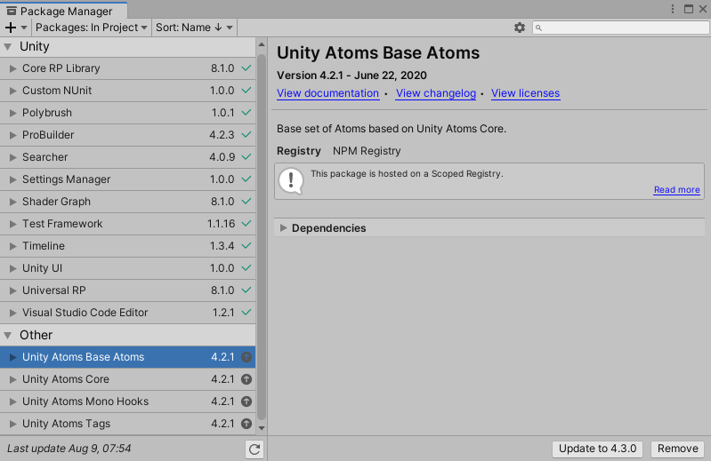

# Installation

Welcome to Unity Atoms! There are several ways to add Unity Atoms to your project.

_Prerequisite: Since Unity Atoms is using the Unity Package Manager (UPM) you need to use Unity version 2018.3 >=_
### NPM

Add the following to your `manifest.json`:

```
{
    "scopedRegistries": [
        {
            "name": "NPM Registry",
            "url": "https://registry.npmjs.org",
            "scopes": [
                "com.unity-atoms.unity-atoms-core",
                "com.unity-atoms.unity-atoms-base-atoms",
                "com.unity-atoms.unity-atoms-fsm",
                "com.unity-atoms.unity-atoms-mobile",
                "com.unity-atoms.unity-atoms-mono-hooks",
                "com.unity-atoms.unity-atoms-tags",
                "com.unity-atoms.unity-atoms-scene-mgmt",
                "com.unity-atoms.unity-atoms-ui",
                "com.unity-atoms.unity-atoms-input-system"
            ]
        }
    ],
    "dependencies": {
        ...
        "com.unity-atoms.unity-atoms-core": "4.5.0",
        "com.unity-atoms.unity-atoms-base-atoms": "4.5.0",
        "com.unity-atoms.unity-atoms-fsm": "4.5.0",
        "com.unity-atoms.unity-atoms-mobile": "4.5.0",
        "com.unity-atoms.unity-atoms-mono-hooks": "4.5.0",
        "com.unity-atoms.unity-atoms-tags": "4.5.0",
        "com.unity-atoms.unity-atoms-scene-mgmt": "4.5.0",
        "com.unity-atoms.unity-atoms-ui": "4.5.0",
        "com.unity-atoms.unity-atoms-input-system": "4.5.0",
        ...
    }
}
```

Note that the core and base atoms packages are mandatory while the others are optional. If you don't want a subpackage, simply remove it from your `dependencies`.

### OpenUPM

The package is available on the [openupm registry](https://openupm.com). It's recommended to install it via [openupm-cli](https://github.com/openupm/openupm-cli).

```
# required
openupm add com.unity-atoms.unity-atoms-core
openupm add com.unity-atoms.unity-atoms-base-atoms

# optional
openupm add com.unity-atoms.unity-atoms-fsm
openupm add com.unity-atoms.unity-atoms-mobile
openupm add com.unity-atoms.unity-atoms-mono-hooks
openupm add com.unity-atoms.unity-atoms-tags
openupm add com.unity-atoms.unity-atoms-scene-mgmt
openupm add com.unity-atoms.unity-atoms-ui
```

### Github URL

There is an alternative approach installing Unity Atoms using the Github URL to this repo.

Add the following to your `manifest.json`:

```
{
    "dependencies": {
        ...
        "com.unity-atoms.unity-atoms": "https://github.com/unity-atoms/unity-atoms.git#master",
        ...
    }
}
```

It's also possible to add specific subpackages using the approach explained [here](https://forum.unity.com/threads/some-feedback-on-package-manager-git-support.743345/#post-5425311).

## Updating

Updating Unity Atoms to a new release when using the Unity Package Manager is as easy as opening the Package Manager window and clicking on `Update` on the selected package.



Follow [Unity Atoms on Github](https://github.com/unity-atoms/unity-atoms) to stay up-to-date on the current version.

## Create your first Atom

To dive right in, create your first Atom using any of the available techniques mentioned in [Creating Atoms](../tutorials/creating-atoms.md).

## Learn more

Go to [overview ](./overview.md) to learn more about Unity Atoms and how to tune in to the correct mindset when using them.
