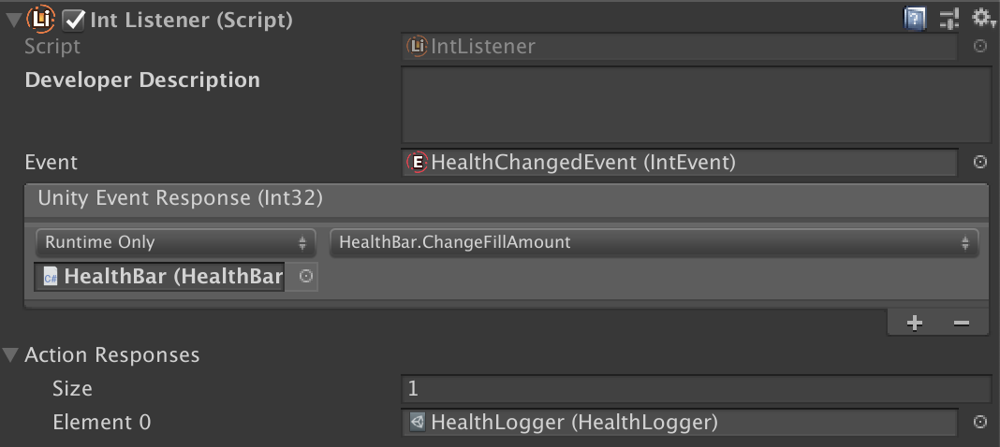

# Actions

The `ChangeFillAmount` function created in the listeners tutorial is actually a Response of type `UnityEvent`. However, in Unity Atoms there is also the possibility to create Responses as Scriptable Objects called Actions. An Action is a function as a Scriptable Object that does not return a value. As a side note there are also Functions in Unity Atoms, which are exactly like Actions, but does return a value. To demonstrate the concept of an Action as a Response lets create an Action called `HealthLogger.cs` that gives some love to the console and logs the player’s health whenever it changes:

```cs
[CreateAssetMenu(menuName = "Unity Atoms/Examples/Health Logger")]
using UnityEngine;
using UnityAtoms.BaseAtoms;

public class HealthLogger : IntAction
{
    public override void Do(int health)
    {
        Debug.Log("<3: " + health);
    }
}
```

It is possible to create the `HealthLogger` by right clicking and go _Create / Unity Atoms / Examples / Health Logger_ (this is available due to the call to `CreateAssetMenu`). When created we can add it as an Action Response to the `HealthListener`:



Every time the player’s health is changed we now log out the player’s health. This particular example is pretty simple, but I’m sure you can come up with lots of other use cases for it (for example play a sound or emit some particles).
