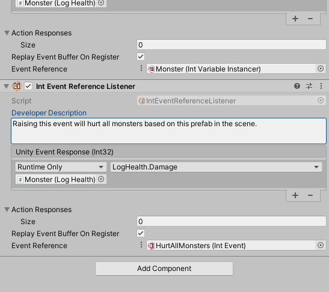
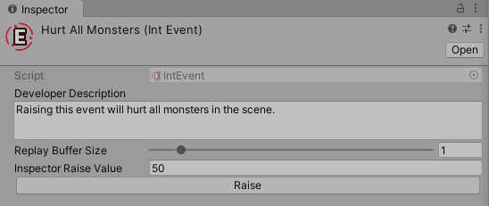
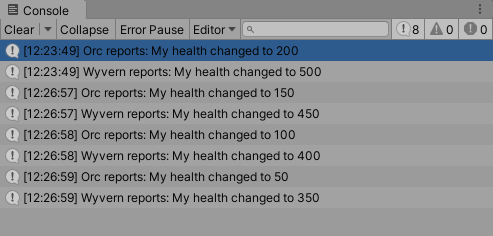
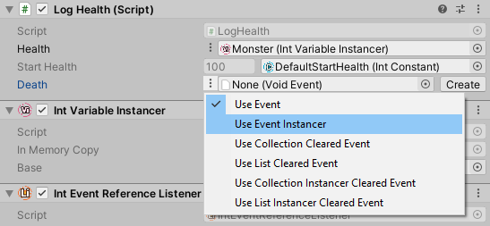
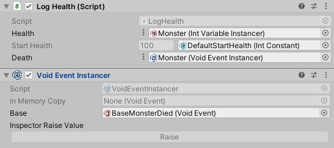
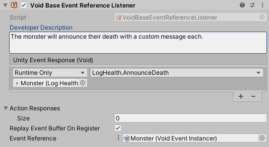
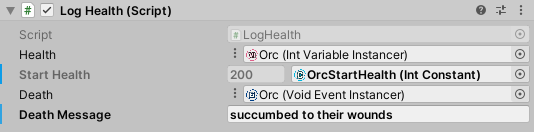
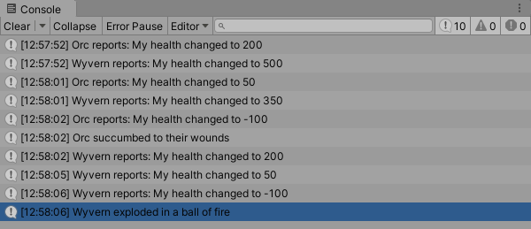

# Event Instancer

Similar to Variables, Events can also be instantiated for use in prefabs. In this tutorial we will build a "death" Event for the monster prefab created in the variable instancer tutorial. The death Event will be fired once as the monster health drops below zero.

Some setup is necessary in our example to demonstrate how an Event Instancer works.

## Damage the monster

To inflict damage on the monster, we can add a method called `Damage` to the `LogHealth` script that subtracts from the current health of the monster:

```cs
using UnityEngine;
using UnityAtoms.BaseAtoms;

public class LogHealth : MonoBehaviour
{
    [SerializeField]
    private IntReference health;
    [SerializeField]
    private IntConstant startHealth;

    public void Start()
    {
        health.Value = startHealth.Value;
    }

    public void Damage(int damage)
    {
        health.Value -= damage;
    }

    public void ReportHealth(int health)
    {
        Debug.Log(gameObject.name + " reports: " +
            "My health changed to " + health);
    }
}
```

At this point `LogHealth` as a name for the component is starting to lose it's meaning, but we'll keep extending the script for simplicity's sake.

## Global damage event

To trigger the `Damage` method, create a new `IntEvent` called `HurtAllMonsters`. Add a new `Int Event Reference Listener` component to the `Monster` base prefab. Have the listener call `Damage` of `LogHealth`:



> **Note:** Make sure the `Damage` method is selected from the `Dynamic` list of methods.

## Raising events from the inspector

Run the scene and find the `HurtAllMonsters` Event from your asset folders. Set the `Inspector Raise Value` to any number and click the `Raise` button.



The monsters in the scene will take the entered amount of damage. Click the button multiple times to repeat inflicting the damage:



The setup is complete. We are now ready to instantiate a death Event for each monster.

## Death event instancer

When the monster health reaches zero or lower, we want to fire a `VoidEvent` to signal that this monster has perished. Listening for this Event in the prefab allows you to customize how each monster type dies. In this example, each monster reports a different death message.

We need logic in the `Damage` method to detect when they monster died and a reference to an Event we want to raise when that happens:

```cs
using UnityEngine;
using UnityAtoms.BaseAtoms;

public class LogHealth : MonoBehaviour
{
    [SerializeField]
    private IntReference health;
    [SerializeField]
    private IntConstant startHealth;
    [SerializeField]
    private VoidBaseEventReference death;

    public void Start()
    {
        health.Value = startHealth.Value;
    }

    public void Damage(int damage)
    {
        if(health.Value > 0)
        {
            health.Value -= damage;

            if(health.Value <= 0)
            {
                death.Event.Raise();
            }
        }
    }

    public void ReportHealth(int health)
    {
        Debug.Log(gameObject.name + " reports: " +
            "My health changed to " + health);
    }
}
```

In the `Monster` prefab's `LogHealth` component, select `Use Event Instancer` on the `Death` Event reference field:



Add a `Void Event Instancer` component and a create a `Void Event` base Event in an asset folder. Select the base Event asset in the `Base` field and drag the `Void Event Instancer` component on the `Death` field of `LogHealth`:



## Listening for the instantiated `Death` Event

To demonstrate the uniqueness of the `Death` Event to each prefab, we'll add a method to `LogHealth` called `AnnounceDeath` that logs a customizable death message for the monster:

```cs
using UnityEngine;
using UnityAtoms.BaseAtoms;

public class LogHealth : MonoBehaviour
{
    [SerializeField]
    private IntReference health;
    [SerializeField]
    private IntConstant startHealth;
    [SerializeField]
    private VoidBaseEventReference death;
    [SerializeField]
    private string deathMessage;

    public void Start()
    {
        health.Value = startHealth.Value;
    }

    public void AnnounceDeath()
    {
        Debug.Log(gameObject.name + " " + deathMessage);
    }

    public void Damage(int damage)
    {
        if(health.Value > 0)
        {
            health.Value -= damage;

            if(health.Value <= 0)
            {
                death.Event.Raise();
            }
        }
    }

    public void ReportHealth(int health)
    {
        Debug.Log(gameObject.name + " reports: " +
            "My health changed to " + health);
    }
}
```

Now add a `Void Base Event Reference Listener` to `Monster` prefab. Wire it to the `Void Event Instancer` component and `AnnounceDeath` method using what you learned in this tutorial. The end result looks like this:



## Testing the `Event Instancer`

Since all of the work was done in a base prefab `Monster`, the changes have automatically propagated to the `Wyvern` and `Orc` variants. Visit the variants and write a different death message for each in the `deathMessage` field of `LogHealth`:



Run the project and inflict damage using the `Raise` button in `HurtAllMonsters` Event's Inspector. Eventually the monsters will run out of health one by one and they should announce their unique death messages:



That's it! You've created an extensible system where every new prefab variant can easily be customized and all the Atoms included in the prefab are automatically wired to correct responses. Use the monster's death Event Listener to play a sound, play an animation, and add experience points for the player. Only your imagination is the limit!
