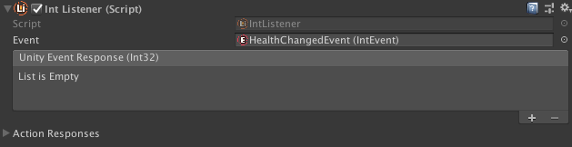
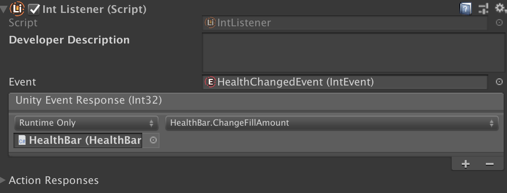

# Listeners

There is still an issue that the `HealthBar.cs` script is in charge of registering itself as a listener and at the same time defining what happens when a Event is raised. We need to seperate its concerns! This brings us to the third concept of Unity Atoms, Listeners. A Listener listens (sometimes also referred to as observes or subscribes) to an Event and responds by firing off zero to many responses. Listeners are MonoBehaviours and therefore live in a scene. They can be seen as the glue between Events and Actions.

The `HealthBar.cs` script from our last example is actually a Listener, but a very specific implementation of it. We can do better than that! Lets create a Game Object in our scene and call it `HealthListener`. Unity Atoms comes with some predefined Listeners. In this case we want to listen to an `IntEvent` so we will press the Add Component button on our `HealthListener`, create an IntListener and drop in the `HealthChangedEvent`:



We can now shave off some of the code in our `HealthBar.cs` script to look like this:

```cs
public class HealthBar : MonoBehaviour
{
    [SerializeField]
    private IntVariable MaxHealth;

    public void ChangeFillAmount(int health)
    {
        GetComponent<Image>().fillAmount = 1.0f * health / MaxHealth.Value;
    }
}
```

And then go back to our `HealthListener`’s IntListener component, press the `+` to add an Unity Event Response, drop in the `HealthBar` component (from the scene) and point out the `ChangeFillAmount` function defined above:



The `HealthBar.cs` script is now only responsible for what happens when our player’s health is changing. Pretty great, huh?
