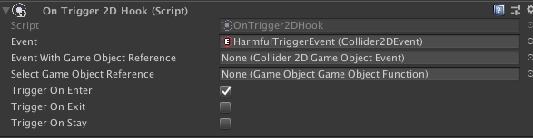
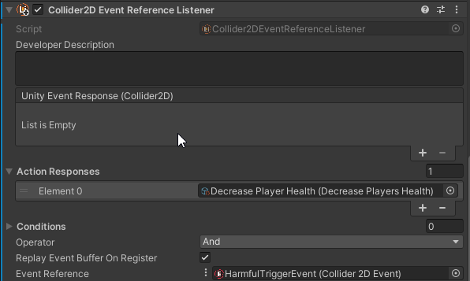

# Mono Hooks

Mono Hooks save the effort of writing boilerplate code to raise Atoms Events from [Unity's Event Functions](https://docs.unity3d.com/Manual/EventFunctions.html).

A great use for Mono Hooks in our example would allow us to remove the `Harmful.cs` script created earlier. We could instead attach a `OnTrigger2DHook.cs` to the Harmful GameObject and toggle on `Trigger On Enter` like this:



We could then create a Collider2DAction called `DecreasePlayersHealth.cs` and add it to a Collider2D Event Reference Listener attached to the Harmful GameObject:

```cs
    public class DecreasePlayersHealth : Collider2DAction
    {
        public override void Do(Collider2D collider)
        {
            if (collider.tag == "Player")
            {
                collider.GetComponent<PlayerHealth>().Health.Value -= 10;
            }
        }
    }
```



There is much less code written and the responses can be edited in the Editor.

That is it! We have covered the most fundamental pieces of Unity Atoms and a way to use them with Unity's built-in functionality. You can get far with these alone, but there are many more features in Unity Atoms and the subpackages to explore.
