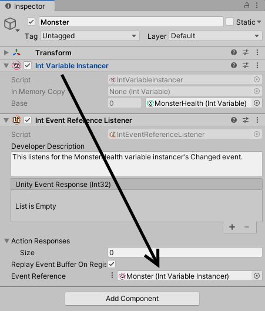

# Variable Instancer

Unity Atoms have no problems with being used in a prefab. However, it will quickly become apparent that all instances of the prefab refer to the one and the same Atom asset, such as a specific `IntVariable` in the asset folder.

For example, changing the value of a variable applies to all prefab instances that use the variable. Triggering the `Changed` event also causes all prefab instances to react. While this still has it's uses, the behaviour is not always desirable.

To break free from global Atoms, variables can be instantiated as an in-memory copy when a prefab is created. To do this, we need a `VariableInstancer`.

> **Note:** A `VariableInstancer` is unique to the type of the variable. The generator can generate a `VariableInstancer` of any type needed. Unity Atoms comes with a set of predefined basic types.

## Add a variable instancer and assign a base variable

Start by creating an empty `GameObject` called `Monster` and add an `Int Variable Instancer` component to it:


The `VariableInstancer` needs a base variable to instantiate. Create any `IntVariable` and use the inspector to add the variable to the `Base` field. You can also click on `Create` to use a shortcut for type-appropriate variable creation from the instancer itself.


## Listening for `Changed` event

The `VariableInstancer` instantiates the appropriate `Changed` and `Changed With History` event instances for this variable. That's why it's possible to listen for the `Changed` event in an `Int Event Reference Listener`. Add an `Int Event Reference Listener` as a component and use the three dots next to `Event Reference` to select `Use Variable Instancer`:


Grabbing from the title of the component, drag the `Int Variable Instancer` on the `Event Reference` field:



This event listener now listens to the instantiated `Changed` event from the `Int Variable Instancer`.

## `Changed` Event response

Let's add a simple script to use a method as a `Unity Event Response` in the listener:

```cs
using UnityEngine;

public class LogHealth : MonoBehaviour
{
    public void ReportHealth(int health)
    {
        Debug.Log(gameObject.name + " reports: " +
            "My health changed to " + health);
    }
}
```

Add the `LogHealth` component and click `+` on the `Unity Event Response`, drag the `LogHealth` to the response field and choose the `ReportHealth` method from the list:


> **Note:** If the method does not appear under the `Dynamic` section with the data type of the listener, the method signature is wrong. The Unity response method can only have one parameter which corresponds to the listener type. Using a method with static parameters will still get called, but won't have access to the event data.

## Usage in a script

To demonstrate that the instancer works as intended, let's add a method to `LogHealth` that initializes the health value to a value from an `IntConstant` on `Start`. To use variable instancers the type of the health variable is `IntReference` instead of `IntVariable`:

```cs
using UnityEngine;
using UnityAtoms.BaseAtoms;

public class LogHealth : MonoBehaviour
{
    [SerializeField]
    private IntReference health;
    [SerializeField]
    private IntConstant startHealth;

    public void Start()
    {
        health.Value = startHealth.Value;
    }

    public void ReportHealth(int health)
    {
        Debug.Log(gameObject.name + " reports: " +
            "My health changed to " + health);
    }
}
```

In the inspector use the three dots next to `Health` of `LogHealth` and select `Variable Instancer`. As before, drag the same variable instancer on the field. Create an `IntConstant` Atom in your asset folder and name it. In this case, it is called DefaultStartHealth and has a value of 100:


Run the project. The `Monster` `GameObject` reports the health immediately on `Start`. Read the stack trace from bottom to up to see how the calls were made:


This however does not prove the instances are unique. You can achieve the same result with global Atoms. Let's see how we can use prefabs to make sure the instancer works.

## Prefabs

Drag the `Monster` `GameObject` to an asset folder and create two `Prefab Variants` from the context menu of the `Monster` prefab. Name them `Orc` and `Wyvern`:


Create two more `IntConstant` Atoms called `WyvernStartHealth` and `OrcStartHealth`:


Open the `Wyvern` prefab variant and replace the `DefaultStartHealth` with `WyvernStartHealth` constant in the `LogHealth` script's inspector:


Do the same for the `Orc` variant and drag an instance of both on the scene and run the project. If everything went according to plan, the console should log the following messages:


Both variable instances are therefore unique. You can now use the variable instancer as a variable in any `IntReference` in your scripts. For example, a damage script would subtract from the variable value and only this instance of the prefab would have it's `Changed` event triggered.
