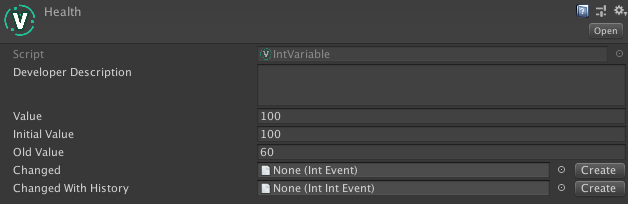
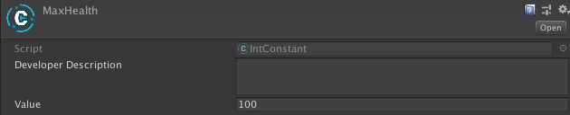

# Variables and constants

Below follows a step-by-step example of managing a player's health using Unity Atoms. If you haven't read the [Overview and philosopy](../introduction/overview.md) section you should do that before proceeding.

_NOTE: This tutorial is based on [this](https://medium.com/@adamramberg/unity-atoms-tiny-modular-pieces-utilizing-the-power-of-scriptable-objects-e8add1b95201) blog post._

## Decouple your scripts using Variables and Constants

Variables are storing data, for example primitives, reference types or structs as Scriptable Objects. Because Variables are stored as Scriptable Objects they are not part of any scene, but could instead be seen as part of the game’s global shared state. Variables are designed to make it easy to inject them (via the Unity Inspector) and share them between your MonoBehaviours. A Constant is a trimmed down version of a Variable and it's value can't be altered at runtime. Lets see an example on how to use Variables and Constants!

Imagine you have a `PlayerHealth.cs` script that contains the health of the game’s player. We will attach the script to a `GameObject` with a `SpriteRenderer`, `BoxCollider2D` and a `Rigidbody2D` called Player. The health is represented by an int, which corresponds to an `IntVariable` in Unity Atoms. The script will look like this:

```cs
public class PlayerHealth : MonoBehaviour
{
    public IntVariable Health;
}
```

In the game the player’s health will decrease when hitting something harmful. We will attach this `Harmful.cs` script to a GameObject called Harmful that also has a `SpriteRenderer` and a `BoxCollider2D` (as a trigger):

```cs
public class Harmful : MonoBehaviour
{
    void OnTriggerEnter2D(Collider2D collider)
    {
        if (collider.tag == "Player")
        {
            collider.GetComponent<Player>().Health.Value -= 10;
        }
    }
}
```

Finally we will add an UI `HealthBar.cs` script that we attach to a `GameObject` (inside a UI Canvas) with a `RectTransforn`, `CanvasRenderer` and UI `Image` component. The `HealthBar.cs` script will update the `Image` representing the health bar when the player’s health is changing:

```cs
public class HealthBar : MonoBehaviour
{
    [SerializeField]
    private IntVariable Health;
    [SerializeField]
    private IntConstant MaxHealth;

    void Update()
    {
        GetComponent<Image>().fillAmount = 1.0f * Health.Value / MaxHealth.Value;
    }
}
```

Since the player's health is going to change at runtime we make `Health` an `IntVariable` while `MaxHealth` is not going to be changed at runtime is therefore created as an `IntConstant`, They are both global assets stored as `.asset` files that are (or could be) shared between scripts. To create these `.asset` files we can right click somewhere in the Project window, and go _Create / Unity Atoms / Variables / Int_ to create the Variable and go _Create / Unity Atoms / Constants / Int_ to create the Constant. The Variable looks like this in the Unity Inspector:



And the Constant looks like this:



The `Developer Description` is a text describing the Variable in order to document it, the `Value` is the actual value of the Variable, and `Old Value` is the last value the Variable had after it was changed via code. `Changed` and `Changed With History` will be explained later in this tutorial. We name the `IntVariable` created to `Health` and the `IntConstant` to `MaxHealth` and set both their initial value to 100. After they are created we can drop them on the `PlayerHealth` and `HealthBar` components via Unity’s inspector like this:


Variables gives us a way of separating our game’s shared state from the actual implementation. It also makes our code less coupled since we do not need to reference other MonoBehaviours in our scripts, eg. we do not need to reference the `PlayerHealth.cs` script in our `HealthBar.cs` script like this:

```cs
[SerializeField]
private PlayerHealth playerHealth;
```

Hurray for less coupled code! 🎉